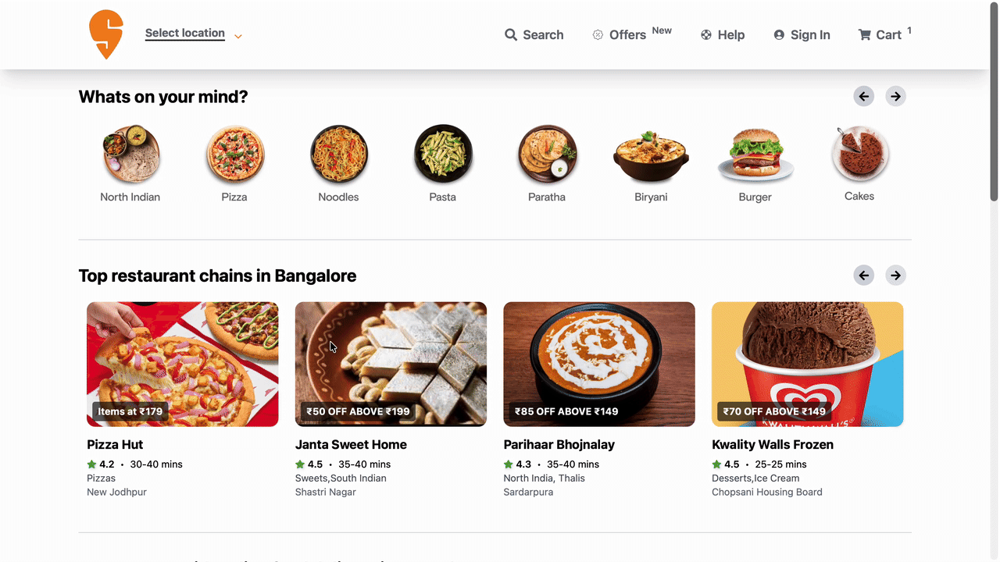

# 🍔 Swiggy Clone

A Swiggy-inspired food delivery web application built using modern frontend technologies.  
This project focuses on UI, component-based architecture, smooth user experience, and real-time data handling from a backend service.

---
🌐 Live Application
🚀 Live Demo:
👉 https://swiggy-clone-main-alpha.vercel.app

## 📽️ Project Demo

<p align="center">
  
</p>

---

## 🚀 Features
- Home page with dynamic restaurant listings  
- Real-time data fetched from **Node.js backend APIs**  
- REST API integration for restaurants, menus, and offers  
- Search functionality with backend-powered filtering  
- Scalable backend architecture using Express.js  
- Asynchronous API handling with proper error management  
- Responsive UI for mobile, tablet, and desktop  
- Modern React component-based architecture  
- Clean and reusable UI components  
- Environment-based configuration using `.env` files  

---

## 🛠️ Tech Stack

### Frontend
- React.js  
- JavaScript (ES6+)  
- CSS / Tailwind CSS  

### Backend
- Node.js  
- Express.js  
- REST APIs  

### Tools
- Git & GitHub  
- Postman (API testing)  

---

## 📦 Installation

### Clone the repository
```bash
git clone https://github.com/Adarshsengar1431/Swiggy-Clone.git
cd Swiggy-Clone
